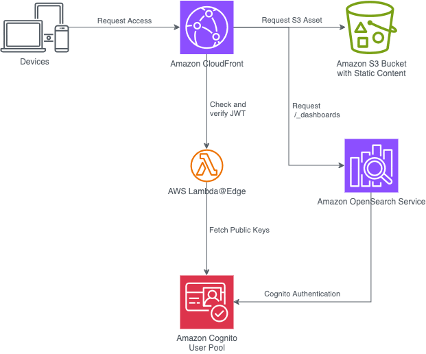

# Embed OpenSearch Dashboards with Cognito Authentication

This project demonstrates how to embed an authenticated OpenSearch Dashboards domain into a website using Amazon Cognito for user authentication. It extends the CloudFront Authorization@Edge solution to handle integration with OpenSearch Dashboards and leverages Amazon CloudFront to serve content to authenticated users.

## Solution Overview



The solution uses various AWS services to provide a seamless and secure experience:

- Amazon CloudFront as the entry point for all requests
- AWS Lambda@Edge for JWT validation and request handling
- Amazon Cognito for user authentication
- Amazon S3 for hosting static website content
- Amazon OpenSearch Service for the OpenSearch Dashboards endpoint

## Key Features

- Single sign-on experience for both the website and embedded OpenSearch Dashboards
- Secure authentication using Amazon Cognito
- Seamless integration of OpenSearch Dashboards within the website
- Customizable to work with both static sites and single-page applications (SPAs)

## Prerequisites

- AWS CLI
- Git
- SAM CLI
- Python 3.8 or later
- pip3
- AWS Credentials with appropriate permissions

## Deployment

1. Clone the repository:
   ```
   git clone https://github.com/savinof/embed-opensearch-dashboards-cognito.git
   cd embed-opensearch-dashboards-cognito
   ```

2. Build and deploy the SAM application:
   ```
   sam build
   sam deploy --parameter-overrides EmailAddress="your-email@mail.com" Nonce=$RANDOM
   ```

3. Update the `index.html` file in `src/cfn-custom-resources/static-site/` with your CloudFront distribution domain.

4. Upload the static site to Amazon S3:
   ```
   aws s3 cp src/cfn-custom-resources/static-site/index.html s3://<bucketname> --cache-control 'public,max-age=60,stale-while-revalidate=86400' --content-type 'text/html; charset=utf-8'
   ```

5. Access your website using the CloudFront distribution domain name.

## Cleanup

1. Delete the website content from the S3 bucket.
2. Delete the CloudFormation stack:
   ```
   sam delete --stack-name "embed-opensearch-dashboards-cognito"
   ```

## Contributing

Contributions are welcome! Please feel free to submit a Pull Request.

## License

This project is licensed under the MIT License - see the [LICENSE](LICENSE) file for details.

## Acknowledgments

- CloudFront Authorization@Edge solution
