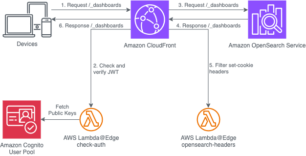
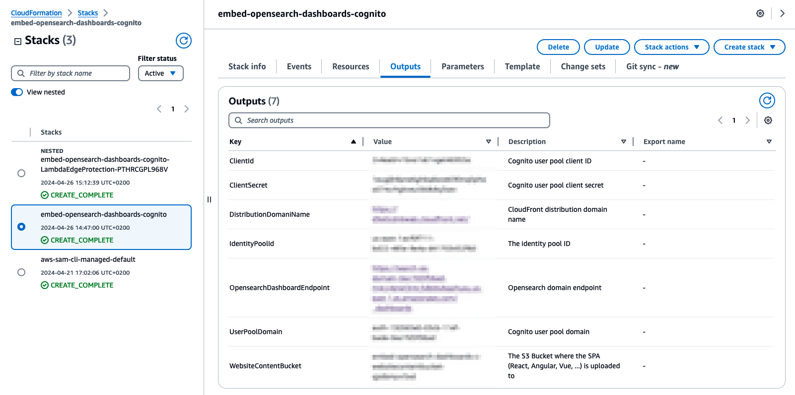
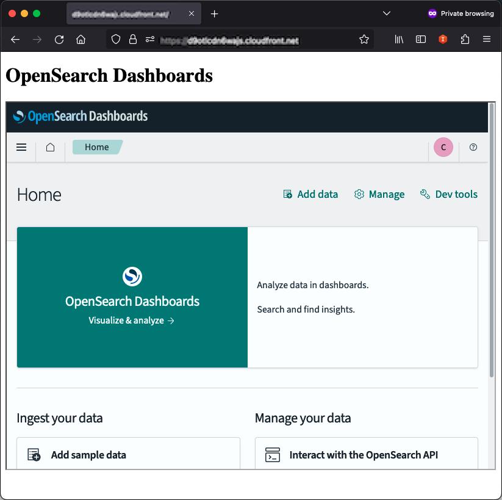

# Embed OpenSearch Dashboards in your website with Cognito authentication

In this blog post, we'll explore how to embed an authenticated OpenSearch Dashboards domain into a website using [Amazon Cognito](https://aws.amazon.com/cognito/) for user authentication. We'll extend the [CloudFront Authorization@Edge](https://aws.amazon.com/blogs/networking-and-content-delivery/authorizationedge-using-cookies-protect-your-amazon-cloudfront-content-from-being-downloaded-by-unauthenticated-users/) solution with additional behavior to handle the integration with OpenSearch Dashboards, and leverage [Amazon CloudFront](https://aws.amazon.com/cloudfront/) to serve content to the authenticated user.

[Amazon OpenSearch Service](https://aws.amazon.com/opensearch-service/) is a fully managed service for deploying, operating, and scaling OpenSearch clusters in a simple and cost-effective manner. [OpenSearch](https://opensearch.org/) is an open-source distributed search and analytics engine widely used for searching, analyzing, and visualizing data. [OpenSearch Dashboards](https://opensearch.org/docs/latest/dashboards/) is the web interface that allows you to create and manage dashboards, visualizations, and reports based on your data stored in OpenSearch.

Embedding an authenticated OpenSearch Dashboards domain into a website using Cognito presents a significant challenge: the need for users to perform a separate login process for accessing the embedded OpenSearch Dashboards, even after being authenticated on the parent website. Forcing users to undergo separate login processes for the parent website and the embedded OpenSearch Dashboards component can significantly degrade the overall user experience. The Cognito access tokens issued for the parent website are typically scoped to that domain and may not be automatically recognized by the OpenSearch Dashboards domain, even when embedded within the same application. As a result, users would need to authenticate again specifically for the OpenSearch Dashboards, creating an unnecessary extra step in their workflow.

This solution aims to address this double login issue by leveraging Amazon CloudFront, AWS Lambda@Edge, and Amazon Cognito in a way that enables seamless authentication for both the parent website and the embedded OpenSearch Dashboards domain. While maintaining essential security measures like Content Security Policies (CSP) and X-Frame-Options headers, this approach ensures a cohesive and unified authentication experience for users, eliminating the need for separate login processes.

## Solution overview

 
The proposed solution leverages different AWS services and components to provide a seamless and secure experience for embedding authenticated OpenSearch Dashboards into a website. The architecture follows a layered approach, with Amazon CloudFront acting as the entry point for all incoming requests.

Requests from users are first routed through CloudFront, which triggers the execution of an [Amazon Lambda@Edge](https://aws.amazon.com/lambda/edge/) function. This function inspects the request and validates the presence of a JSON Web Token (JWT) in the cookies. Only requests with a valid JWT are forwarded to the respective origins, such as [Amazon S3](https://aws.amazon.com/s3/) for hosting the static website content or the Amazon OpenSearch Dashboards endpoint.

In case a request does not contain a valid JWT, the user is redirected to the Amazon Cognito Hosted UI, where they must complete the sign-in process. The solution utilizes a Cognito User Pool configured with a hosted UI for user authentication.

Upon successful sign-in, the user receives an authorization code from Cognito. The Lambda@Edge function parses and validates this authorization code, generating a JWT which is then set in the user's browser cookies. These cookies, containing the JWT, are automatically included in subsequent requests made by the user's browser, enabling seamless access to the protected website content and the embedded OpenSearch Dashboards without requiring additional authentication steps.

The static website content, consisting of an HTML page, is hosted on Amazon S3 and served from the root domain (e.g., `d123xyz4567.cloudfront.net`). On the other hand, the OpenSearch Dashboards domain is served from a specific path (e.g., `d123xyz4567.cloudfront.net/_dashboards`) within the same domain.

By leveraging CloudFront as the entry point, the Lambda@Edge function for JWT validation, and the integration with Cognito for user authentication, this solution ensures that only authorized users can access the website and visualize the opensearch dashboards content embedded, providing a cohesive and secure experience without the need of multiple logins.

## Key solution parameters and behavior

The core component of this solution is built upon Cloudfront Authorization@Edge repository, with the addition of OpenSearch Dashboards behavior. Several key parameters play a crucial role in enabling this integration:

1. **HttpHeaders**: This parameter specifies a set of HTTP headers that enable the correct functioning and embedding of OpenSearch Dashboards within the website.
2. **CookieCompatibility**: By setting this parameter to `"elasticsearch"`, the solution ensures that cookies are set with the required keys (`ID-TOKEN`, `ACCESS-TOKEN`, `REFRESH-TOKEN`) to allow OpenSearch Dashboards to recognize and validate the user's authentication state.
3. **EnableSPAMode**: In this implementation, `EnableSPAMode` is set to `false`, which utilizes the static site mode. In this mode, a client secret is used for the Cognito User Pool client, and cookies are set with the `HttpOnly` attribute, ensuring that they can only be accessed via HTTP(S) requests and not through client-side scripts.

While the current configuration uses the static site mode, the solution can be adapted to work with the Single-Page Application (SPA) mode as well. In the SPA mode, cookies are not set with the `HttpOnly` attribute, allowing client-side scripts to access them. To enable SPA mode, you would need to:

* Set the `EnableSPAMode` parameter to `true`.
* Consider passing the appropriate `CookieSettings` parameter to configure the desired cookie behavior.
* Update the CloudFormation template to include a CloudFront error page that redirects to the `index.html` file, ensuring proper routing for single-page applications. 
    

Additionally, the `RewritePathWithTrailingSlashToIndex` parameter is set to `true`, which ensures that requests with a trailing slash are rewritten to serve the `index.html` file. This behavior may need to be disabled (`false`) when working with single-page applications, depending on the specific routing requirements.

The solution introduces new behavior specifically for handling requests to the OpenSearch Dashboards domain, which is served from the `/_dashboards` path within the CloudFront distribution. A Lambda@Edge function, executed at the origin response stage, filters out unnecessary token-related headers sent by the OpenSearch Dashboards application, such as `ID-TOKEN`, `ACCESS-TOKEN`, and `REFRESH-TOKEN`. These tokens are already set in the user's browser cookies during the initial Cognito login process and are checked on every subsequent request to CloudFront for authentication purposes. Including these tokens in the response headers from OpenSearch Dashboards would be redundant and could potentially cause conflicts or security issues. Instead, the Lambda@Edge function ensures that only the necessary headers for subsequent session handling on the server-side, such as `security_authentication`, are included in the response.



The diagram above illustrates the flow of events when the `/_dashboards` path is requested, which serves the OpenSearch Dashboards content within the website. The process unfolds as follows:


1. The user's browser initiates an HTTP GET request for `/_dashboards`.
2. CloudFront invokes the `check-auth` Lambda@Edge function to validate the presence of a valid JWT in the request.
3. Upon successful validation, CloudFront forwards the request to the OpenSearch Dashboards domain.
4. The OpenSearch Dashboards application responds with the requested content, which is sent back to CloudFront.
5. CloudFront invokes the `opensearch-headers` Lambda@Edge function, which filters out unnecessary headers from the OpenSearch Dashboards response.
6. The filtered response containing the OpenSearch Dashboards content is then delivered to the user's browser, seamlessly embedding the authenticated OpenSearch Dashboards within the website.

This flow ensures that only authorized users with valid JWT tokens can access the OpenSearch Dashboards content, while also enabling a seamless integration with the OpenSearch Dashboards application by filtering out redundant headers, eliminating the need for separate authentication processes.

By customizing the parameters mentioned and extending the Cloudfront Authorization@Edge solution with the additional behavior for handling OpenSearch Dashboards requests, the proposed implementation achieves a secure and seamless integration between Amazon Cognito, OpenSearch Dashboards, and your website. This integration allows users to access the authenticated OpenSearch Dashboards content without the need for multiple logins, providing a cohesive and unified authentication experience.


>**Note:** With this solution, authenticated users will assume the authenticated user role configured in Cognito. By default, this role is associated with the administrator role of the OpenSearch cluster, granting full access privileges. However, it's recommended to follow the principle of least privilege and assign appropriate permissions based on the intended use case. For example, when embedding OpenSearch Dashboards, you may want to grant read-only permissions to users, limiting their ability to modify or delete data.

To configure granular permissions and roles for OpenSearch clusters based on Cognito authentication, please refer to [Configuring Amazon Cognito authentication for OpenSearch Dashboards](https://docs.aws.amazon.com/opensearch-service/latest/developerguide/cognito-auth.html).


## Prerequisites

To deploy this solution you need to have the following tools and resources installed:


* **AWS CLI**: Follow the instructions to [install the AWS CLI](https://docs.aws.amazon.com/cli/latest/userguide/getting-started-install.html) on your system.
* **Git**: You'll need to have Git installed on your machine to clone the GitHub repository containing the solution's source code.
* **SAM CLI**: Follow the instructions to [install the SAM CLI](https://docs.aws.amazon.com/serverless-application-model/latest/developerguide/serverless-sam-cli-install.html) on your system. By having the AWS Serverless Application Model (SAM) CLI installed, you can easily build, test, and deploy serverless applications on AWS. The SAM CLI provides a convenient way to package and deploy the Lambda functions and other resources required for this solution.
* **Python 3**: You'll need to have Python 3.8 or a later version installed on your machine, as it serves as the runtime environment for the AWS Lambda functions used in this solution.
* **pip3**: The package installer for Python 3 is required to install additional Python modules. You'll need to install the [crhelper](https://aws.amazon.com/blogs/infrastructure-and-automation/aws-cloudformation-custom-resource-creation-with-python-aws-lambda-and-crhelper/) module using: `pip3 install crhelper`
* **AWS Credentials**: You'll need AWS credentials with sufficient permissions to create and manage resources in your AWS account, such as Amazon CloudFront distributions, AWS Lambda functions, Amazon Cognito User Pools, and Amazon S3 buckets.
* **IAM Roles**: The solution requires creating IAM roles for granting necessary permissions to the Lambda functions and other AWS resources. Ensure that your AWS credentials have the required permissions to provision and configure these IAM roles.

With these prerequisites in place, you'll be ready to deploy the solution and embed OpenSearch Dashboards into your website using Cognito authentication.

## Procedure

Once you have the prerequisites set up, follow these steps to build and deploy the application for the first time:

1. **Clone the GitHub repository**
    
    First, you'll need to clone the GitHub repository containing the source code for the solution. Open your terminal or command prompt and run the following command:

```
git clone https://github.com/savinof/embed-opensearch-dashboards-cognito.git
cd embed-opensearch-dashboards-cognito
```

This will create a local copy of the repository on your machine end change directory to` embed-opensearch-dashboards-cognito`.

1. **Build and deploy the SAM application**

```
sam build
sam deploy --parameter-overrides EmailAddress="your-email@mail.com" Nonce=$RANDOM
```

The `sam build` command will build the SAM application and prepare it for deployment. The `sam deploy` command will deploy the application to AWS. Replace `"your-email@mail.com"` with your email address, which will be used for the initial login. The `Nonce` parameter is set to a random value to ensure uniqueness of each deployment in order to trigger upadate of custom resources.



1. **Embed OpenSearch Dashboards inside your static site**
    
    After the deployment is complete, you'll need to upload your static site content.
    1. Open the `index.html` file in the `src/cfn-custom-resources/static-site/` directory (part of the cloned GitHub repository).
    2. use the following example to update your webpage, replacing `d123xyz4567.cloudfront.net` with the value of `DistributionDomainName` from the CloudFormation output section:

```
<!DOCTYPE html>
<html>
<body>
  <h1>OpenSearch Dashboards</h1>
  <iframe src="https://d123xyz4567.cloudfront.net/_dashboards/app/home#/" title="OpenSearch Dashboards" height="600" width="800"></iframe>
</body>
</html>
```

1. **Upload the Static Site to Amazon S3**

To host your static site content on Amazon S3, you have a few options. One approach is to use the [s3-spa-upload](https://www.npmjs.com/package/s3-spa-upload)  module, a third-party package that simplifies the process by automatically uploading your files to S3 and setting the appropriate Content-Type and Cache-Control metadata. Alternatively, you can leverage the AWS Command Line Interface (CLI) or manually upload the files using the AWS Management Console.

If you're hosting a simple website with an `index.html` file, as is the case in this solution, you can use the following AWS CLI command to upload your content and set the necessary caching headers:

```
aws s3 cp src/cfn-custom-resources/static-site/index.html s3://<bucketname> --cache-control 'public,max-age=60,stale-while-revalidate=86400' --content-type 'text/html; charset=utf-8'
```

Replace `<bucketname>` with the name of your S3 bucket created during the deployment, which can be found in the `WebsiteContentBucket` output parameter from the CloudFormation stack.

The `--content-type` parameter specifies the MIME type of the file, which is important for web browsers to correctly interpret and render the content.

The `--cache-control` parameter sets the caching behavior for your content, allowing browsers to cache the file for up to 60 seconds (`max-age=60`), while also enabling stale content to be served for up to 86,400 seconds (24 hours) while the browser revalidates the content in the background (`stale-while-revalidate=86400`). This caching strategy helps improve performance by reducing the number of requests made to the origin server.

For more complex websites or single-page applications (SPAs), you may want to consider a more sophisticated caching strategy that involves setting different Cache-Control headers for different file types, such as HTML, CSS, JavaScript, and other assets. This approach can further optimize the caching and performance of your website by ensuring that frequently updated files are not cached for too long, while static assets are cached more aggressively. The blog post [Host Single Page Applications (SPA) with Tiered TTLs on CloudFront and S3](https://aws.amazon.com/blogs/networking-and-content-delivery/host-single-page-applications-spa-with-tiered-ttls-on-cloudfront-and-s3/) is a great resource on this topic and provides guidance on implementing this caching strategy.

1. **Navigate to your website**
    1. Once the static site is uploaded, you can access your website by entering the CloudFront distribution domain name (e.g., `d123xyz4567.cloudfront.net`) in your web browser.
    2. During the initial login, provide the email address you specified as a parameter during deployment. You should have received a temporary password via email. After entering the temporary password, you'll be prompted to set a new password.



After completing these steps, you should be able to access the website with the embedded, authenticated OpenSearch Dashboards domain using Cognito authentication.

## Cleanup

To avoid incurring unnecessary charges, it's important to delete the resources created during the deployment procedure when they are no longer needed. Follow these steps to clean up the resources:


1. **Delete the website content from the S3 bucket**
    Delete all the files in the `WebsiteContentBucket` S3 bucket. By ensuring the bucket is empty, CloudFormation will be able to delete the bucket itself during the stack deletion process.
2. **Delete the CloudFormation stack**
    Run the following command to delete the CloudFormation stack:

```
   sam delete —stack-name "embed-opensearch-dashboards-cognito"
```

Note: During the stack deletion process, some of the Lambda@Edge functions may end up in a `DELETE_FAILED` state. If this occurs, wait a few hours and re-run the same command again. This will allow CloudFormation to retry the deletion and successfully remove all the resources.

By following these steps, you'll ensure that all the resources created during the deployment procedure are properly deleted, preventing any unnecessary charges from accruing on your AWS account.

## Conclusion

Throughout this blog post, we explored a solution for embedding an authenticated OpenSearch Dashboards domain into a website using Amazon Cognito for user authentication. By extending the Cloudfront Authorization@Edge solution with additional behavior and leveraging services like Amazon CloudFront, AWS Lambda, and Amazon S3, we were able to provide a seamless and secure experience for users.

The proposed solution tackles the challenge of double logins when embedding authenticated OpenSearch Dashboards into a website. By seamlessly integrating Amazon Cognito authentication with CloudFront and Lambda@Edge, users can access the OpenSearch Dashboards content without the need for a separate authentication process, providing a cohesive and unified experience. The solution ensures that access tokens issued by Cognito for the parent website are automatically recognized and honored by the embedded OpenSearch Dashboards domain, eliminating the need for users to perform multiple logins.

While the implementation details might seem complex at first glance, the step-by-step instructions provided in this post should guide you through the deployment process, enabling you to integrate OpenSearch Dashboards into your website or application with relative ease.

Notably, the Cloudfront Authorization@Edge solution played a crucial role in simplifying the implementation and enabling the reuse of existing code. By leveraging this solution, you’ll be able to implement the desired mechanism efficiently and effectively.

We hope this blog post has provided you with valuable insights and a practical solution for integrating OpenSearch Dashboards into your website using Cognito authentication. Feel free to share your experiences, feedback, or any improvements you've made to the solution in the comments section below.

## About the author

Franco Savino is a Solutions Architect based in Milan, Italy, with a strong focus on data analytics and data engineering. He specializes in designing and implementing data-driven solutions on the AWS cloud, leveraging services for data processing, storage, and visualization.
